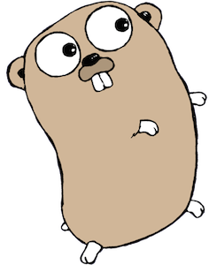

# Images example

This is a small example demonstrating the use of `gd`. The output
in this README is derived from running [example.go](example.go)
with `gd example.go >README.md`.

This comment will be rendered into the Markdown as plain text,
Markdown rendering of a C-style comment requires the `{md}` tag
immediately following the `/*` comment opening.
```

package main

import (
	"fmt"
	"image"
	"log"
	"net/http"
	"path"

```
The "show" package is a magic package that is resolved by the
`gd` build tool. The full path may also be used, then it would
be "github.com/kortschak/gd/show".
```
	"show"

```
Although both jpeg and png input images are being handled by this
example, all images are finally rendered as png.
```
	_ "image/jpeg"
	_ "image/png"
)

var locations = []string{
	"https://blog.golang.org/gopher/glenda.png",
	"https://blog.golang.org/gopher/gopher.png",
	"https://blog.golang.org/gopher/header.jpg",
}

func main() {
```
Each iteration of the loop will be rendered into the Markdown.
```
	for _, url := range locations {
		resp, err := http.Get(url)
		if err != nil {
			log.Fatal(err)
		}
		img, format, err := image.Decode(resp.Body)
		if err != nil {
			log.Fatal(err)
		}
		err = resp.Body.Close()
		if err != nil {
			log.Fatal(err)
		}
		fmt.Printf("The image at %s is a %s.\n", url, format)
```
> ```stdout
> The image at https://blog.golang.org/gopher/glenda.png is a png.
> ```
> ```stdout
> The image at https://blog.golang.org/gopher/gopher.png is a png.
> ```
> ```stdout
> The image at https://blog.golang.org/gopher/header.jpg is a jpeg.
> ```
```
		show.PNG(img, url, path.Base(url))
```
> 

> 

> 
```
	}
}
```
